# Bookstore Website

This is a **Bookstore Website** project developed as part of the *Advanced Web Programming* course at Saigon University. The goal of this project is to create an online platform for buying and selling books, providing users with an easy, convenient, and efficient shopping experience.

# Contribution
This project was developed by:

- Nguyễn Ngọc Đính (3120410130) - Team Leader
- Phạm Triều Điền (3120410129)
- Huỳnh Thành Đạt (3120410113)

## Features

### For Users:
- **Search Products:**
  - Search books by title.
  - Filter books by popularity.
- **Account Management:**
  - Register a new account.
  - Log in to access personalized features.
- **Shopping Features:**
  - View detailed information about books, including title, price, author, and description.
  - Add books to the cart and update or remove them as needed.
  - Proceed to checkout and place orders.
- **Order Management:**
  - View order history and track order statuses.
  - Update account information.

### For Admins:
- **Customer Management:**
  - View and manage customer information.
- **Book Management:**
  - Add new books, edit existing entries, and update stock levels.
- **Order Management:**
  - View and update the status of customer orders.
- **Revenue Statistics:**
  - Generate sales reports and revenue statistics.
- **Category and Author Management:**
  - Organize books by categories and authors.

## Tools and Technologies Used
- **Frontend:** HTML, CSS, JavaScript
- **Backend:** PHP, MySQL
- **Design Tools:** Draw.io (ERD, DFD, mockups), Canva (logo design)
- **Code Management:** GitHub
- **Development Environment:** Visual Studio Code, XAMPP
- **Testing and Collaboration:** Postman, Google Meet, Zalo

# Bookstore Website

## Screenshots

#### Register and Login

  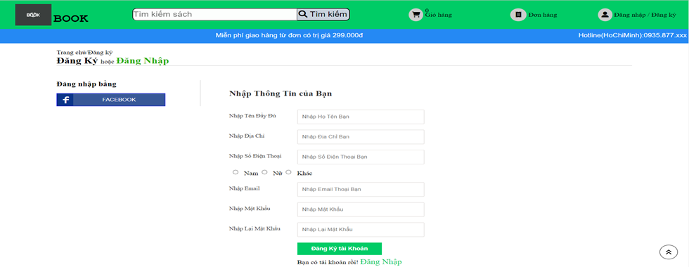 
  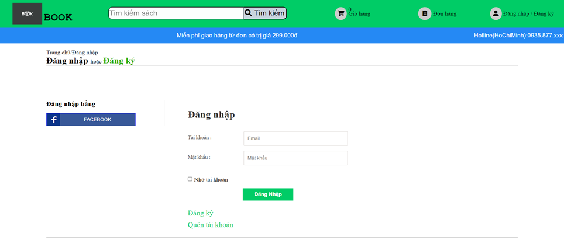

#### Product Details and Homepage

  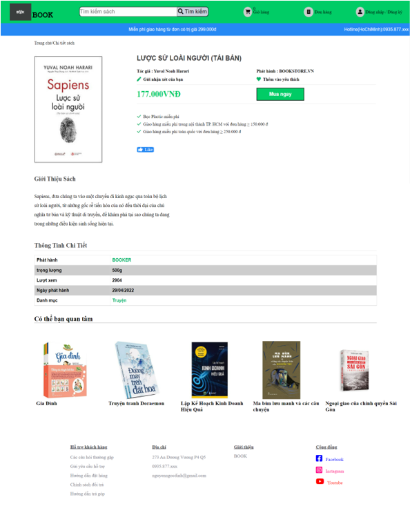
  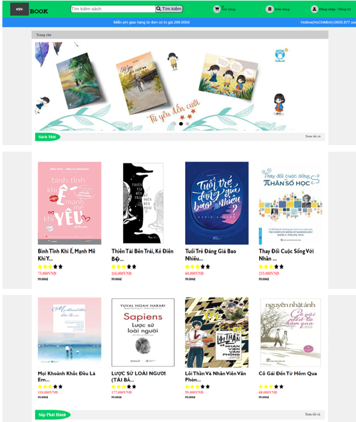

#### Cart and Order

  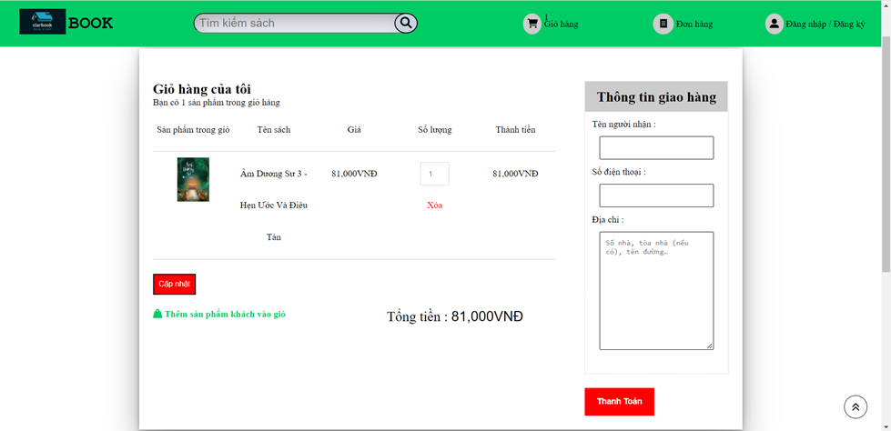
  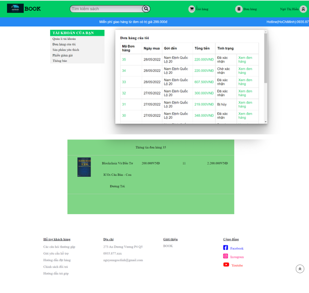

### Admin Interface

#### Dashboard and Order Management

  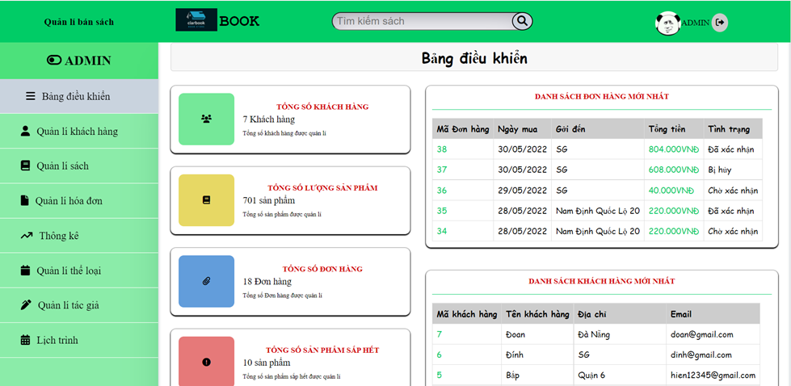
  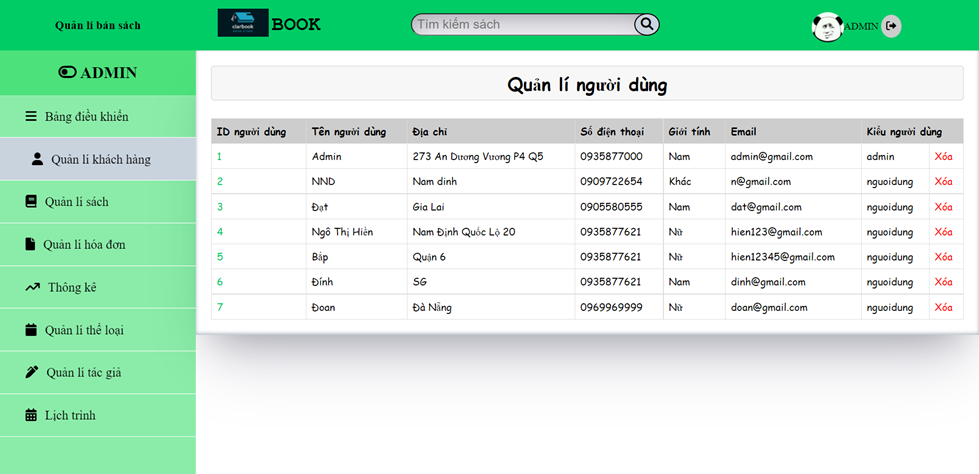

#### Book Management and Statistics

  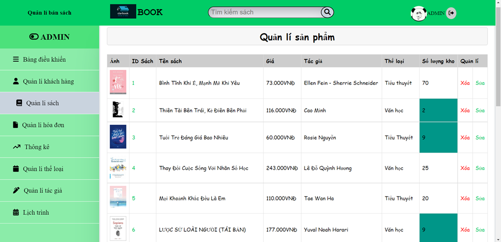
  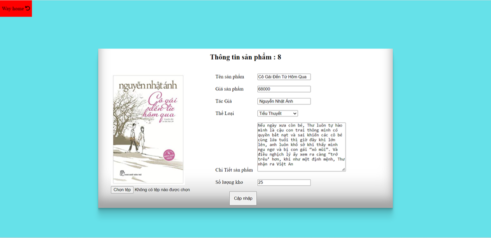

#### Customer Management and Settings

  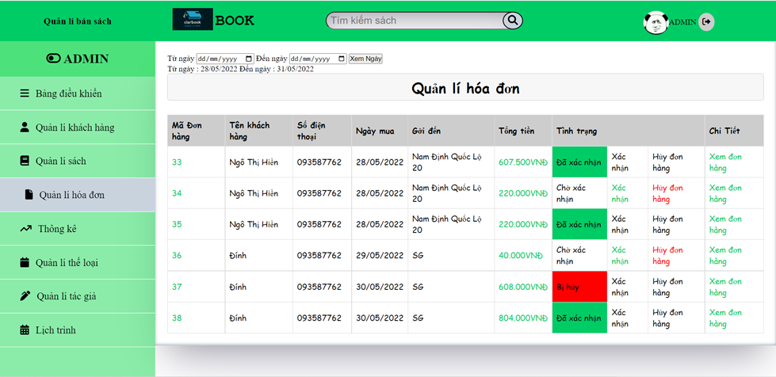
  

